# Diabetes Prediction MLOps Project

This project demonstrates MLOps practices for training and tracking machine learning models using Azure Machine Learning, Python, scikit-learn, and MLflow. It supports three workflows:
- **GitHub Actions with Azure ML**: Automated cloud training via GitHub
- **Azure ML Direct**: Manual cloud training via Azure CLI
- **Local MLflow**: Traditional local development

## 🏗️ Project Structure

```
experiment-mlops/
├── .github/
│   └── workflows/
│       ├── 00-manual-trigger-job-dev.yml  # Manual GitHub Actions trigger
│       ├── 01-pull-request-checks.yml # PR quality checks (linting, tests)
│       └── 02-train-and-register-prod-model.yml    # Automated CI/CD ML pipeline
├── src/
│   ├── model/
│   │   └── train.py                   # Main training script with MLflow tracking
│   ├── job-dev.yml                       # Azure ML job config (development)
│   └── job-prod.yml                  # Azure ML job config (production)
├── experimentation/
│   └── data/                         # Development dataset (diabetes-dev.csv)
├── production/
│   └── data/                         # Production dataset (diabetes-prod.csv)
├── tests/                            # Unit tests
├── requirements.txt                  # Python dependencies
├── mlruns/                          # Local MLflow tracking directory
└── README.md                        # This file
```

# ALWAYS WORK FROM PYTHON VIRTUAL ENVIRONMENT AND DEACTIVATE ONCE DONE!!! 

## 📋 Daily Development Workflow

### 🚀 Starting Development (First Time Setup)
```bash
# 1. Clone repository and navigate to project
git clone <repository-url>
cd experiment-mlops

# 2. Create feature branch (no virtual environment needed)
git checkout -b feature/your-feature-name

# 3. Create virtual environment
python -m venv venv

# 4. Activate virtual environment
# On Windows:
venv\Scripts\activate
# On macOS/Linux:
source venv/bin/activate

# 5. Install dependencies (needs virtual environment)
pip install -r requirements.txt

# 6. Verify setup (needs virtual environment)
python -m pytest -v
```

### 🌅 Daily Start (Continuing Development)
```bash
# 1. Navigate to project
cd path/to/your/experiment-mlops

# 2. Activate virtual environment
# On Windows:
venv\Scripts\activate
# On macOS/Linux:
source venv/bin/activate

# 3. Verify environment (optional)
python -m pytest -v

# 4. Start developing!
```

#### 🖥️ **Cursor IDE Users** (VS Code Compatible):
- **Open Project**: `File > Open Folder` → Select `experiment-mlops`
- **Check Status Bar**: Should show `(venv)` and correct Python interpreter
- **Select Interpreter**: `Ctrl+Shift+P` → "Python: Select Interpreter" → Choose venv path
- **Integrated Terminal**: `Ctrl+`` ` (automatically activates virtual environment)

### 🌙 End of Day
```bash
# 1. Commit your work
git add .
git commit -m "Your commit message"
git push origin feature/your-feature-name

# 2. Deactivate virtual environment
deactivate

# 3. Close terminal/IDE
```

### 🔄 Next Day Continuation
```bash
# 1. Navigate to project
cd path/to/your/experiment-mlops

# 2. Activate virtual environment
# On Windows:
venv\Scripts\activate
# On macOS/Linux:
source venv/bin/activate

# 3. Continue development
```

### ✅ Key Commands Reference
- **Activate**: 
  - Windows: `venv\Scripts\activate`
  - macOS/Linux: `source venv/bin/activate`
- **Deactivate**: `deactivate`
- **Run tests**: `python -m pytest -v`
- **Check packages**: `pip list`
- **Install new package**: `pip install package-name`

---

## 🚀 Quick Start Options

### 🤖 **Option A: GitHub Actions with Azure ML (Recommended)**
Complete automated CI/CD pipeline with environment separation and approval workflows.

### 📋 **Alternative Options:**
- **Option B**: [Azure ML Direct](README_AZURE_ML_DIRECT.md) - Manual cloud training via Azure CLI
- **Option C**: [Local MLflow](README_LOCAL_MLFLOW.md) - Traditional local development workflow

---

# 🔄 Complete MLOps Workflow Execution

## 📊 CI/CD Pipeline Overview

This project implements a comprehensive MLOps pipeline with two complementary GitHub Actions workflows:

### 🔍 **Workflow 1: Pull Request Code Verification** (`01-pull-request-checks.yml`)
- **Trigger**: Pull requests to `main` branch
- **Purpose**: Quality gate before code merges
- **Actions**: Code linting, unit testing, dependency verification

### 🚀 **Workflow 2: Train and Register Prod Model Pipeline** (`02-train-and-register-prod-model.yml`)
- **Trigger**: Pushes to `main` branch (after PR merge)
- **Purpose**: Automated ML training with environment separation
- **Actions**: Development training → Production training (with approval)

## 🎯 Complete Workflow Execution Flow

### **Phase 1: Development & Pull Request**

```mermaid
graph TD
    A[Developer creates feature branch] --> B[Code changes + commit]
    B --> C[Create Pull Request to main]
    C --> D[01-pull-request-checks.yml triggers]
    D --> E[Code Verification: Linting + Tests]
    E --> F{Tests Pass?}
    F -->|❌ Fail| G[Fix issues, push changes]
    G --> D
    F -->|✅ Pass| H[PR approved & merged to main]
```


**Step-by-step:**
1. **Developer Workflow**:
   ```bash
   git checkout -b feature/new-model-improvement
   # Make code changes
   git add .
   git commit -m "Improve model accuracy"
   git push origin feature/new-model-improvement
   ```

2. **Create Pull Request**: Developer creates PR to `main` branch

3. **Automated Quality Checks** (`01-pull-request-checks.yml`):
   - ✅ **Code Linting**: `flake8` checks code style
   - ✅ **Unit Tests**: `pytest` validates functionality
   - ✅ **Dependency Check**: Ensures requirements.txt compatibility
   - ❌ **Blocks merge** if any check fails

4. **Code Review & Merge**: After approval, PR merges to `main`

### **Phase 2: Automated ML Training Pipeline**

```mermaid
graph TD
    H[Code merged to main] --> I[02-train-and-register-prod-model.yml triggers]
    I --> J[Development Job Starts]
    J --> K[Submit Azure ML Dev Job]
    K --> L[Poll Azure ML Status Every 30s]
    L --> M{Azure ML Dev Complete?}
    M -->|❌ Failed| N[GitHub Actions FAILS ❌]
    M -->|⏳ Running| L
    M -->|✅ Success| O[GitHub Actions SUCCESS ✅]
    O --> P[Production Job Waits for Approval]
    P --> Q[Manual Approval Required]
    Q --> R[Submit Azure ML Prod Job]
    R --> S[Poll Azure ML Prod Status Every 30s]
    S --> T{Azure ML Prod Complete?}
    T -->|❌ Failed| U[GitHub Actions FAILS ❌]
    T -->|⏳ Running| S
    T -->|✅ Success| V[Complete Pipeline SUCCESS ✅]
    
    style H fill:#e1f5fe
    style N fill:#ffebee
    style U fill:#ffebee
    style O fill:#e8f5e8
    style V fill:#e8f5e8
    style Q fill:#fff3e0
```


**Step-by-step:**

5. **Automatic Trigger**: Push to `main` triggers `02-train-and-register-prod-model.yml`

6. **Development Training** (Automatic):
   - **Environment**: `development` (no approval needed)
   - **Data**: `diabetes-dev-folder` (small dataset)
   - **Secrets**: Uses `AZURE_CRED_LOGIN_SP_DEV_ENV`
   - **Process**: Submits job to Azure ML and **waits for completion**
   - **Purpose**: Validate model training works with new code

7. **Production Training** (Manual Approval):
   - **Dependency**: Only runs if development **Azure ML job completes successfully**
   - **Environment**: `production` (requires approval)
   - **Data**: `diabetes-prod-folder` (full dataset)
   - **Secrets**: Uses `AZURE_CRED_LOGIN_SP_PROD_ENV`
   - **Process**: Submits job to Azure ML and **waits for completion**
   - **Purpose**: Train production model with complete data

## 🔒 Environment Separation & Security

### **Development Environment**
- **Access**: Automatic execution
- **Data**: Small development dataset (`diabetes-dev-folder`)
- **Service Principal**: `AZURE_CRED_LOGIN_SP_DEV_ENV`
- **Purpose**: Rapid iteration and testing

### **Production Environment**
- **Access**: Manual approval required
- **Data**: Full production dataset (`diabetes-prod-folder`)
- **Service Principal**: `AZURE_CRED_LOGIN_SP_PROD_ENV`
- **Purpose**: Production model training with complete data

## 📈 Monitoring & Results

### **GitHub Actions Monitoring**
- **Pull Request Checks**: View status directly on PR
- **Training Pipeline**: Monitor in Actions tab
- **Approval Workflow**: Production environment shows pending approval

### **Azure ML Monitoring**
- **Development Experiment**: `diabetes-prediction`
- **Production Experiment**: `diabetes-prediction-production`
- **Metrics Comparison**: Compare dev vs prod model performance
- **MLflow Tracking**: All runs automatically logged

## 🎯 Real-World Scenario Example

### **Scenario**: Data scientist improves model regularization

1. **Development**:
   ```bash
   git checkout -b feature/improve-regularization
   # Edit src/model/train.py - change regularization logic
   git commit -m "Add adaptive regularization"
   git push origin feature/improve-regularization
   ```

2. **Pull Request**:
   - Create PR to `main`
   - `01-pull-request-checks.yml` runs automatically
   - Code passes linting and unit tests ✅
   - PR gets reviewed and approved

3. **Merge to Main**:
   ```bash
   git checkout main
   git pull origin main  # Contains merged changes
   ```

4. **Automated Training**:
   - `02-train-and-register-prod-model.yml` triggers automatically
   - **Development job**: Trains with small dataset, validates improvement
   - **Success**: Development model shows better accuracy ✅
   - **Production approval**: Team receives notification for approval

5. **Production Deployment**:
   - Team approves production training
   - **Production job**: Trains with full dataset
   - **Results**: Both models logged to Azure ML for comparison

6. **Validation**:
   - Compare development vs production metrics
   - Verify improvement holds with full dataset
   - Model ready for deployment to inference endpoints

## 🚨 Failure Scenarios & Recovery

### **Pull Request Check Failures**
```bash
# If linting fails:
flake8 src/model/  # Check specific issues
autopep8 --in-place --aggressive --aggressive src/model/train.py

# If tests fail:
python -m pytest tests/ -v  # See detailed test results
```

### **Development Training Failures**
- **Action**: Check Azure ML job logs
- **Common Issues**: Data asset not found, compute cluster issues
- **Recovery**: Fix issues and push new commit (triggers new workflow)

### **Production Approval Timeout**
- **Action**: Manual approval in GitHub Actions
- **Backup**: Re-run workflow if approval expires

## 🎉 Success Metrics

**Complete workflow success means**:
- ✅ Code quality checks pass
- ✅ Development **Azure ML job completes successfully** (not just submits)
- ✅ Production job waits for manual approval
- ✅ Production **Azure ML job completes successfully** (not just submits)
- ✅ Both models logged to Azure ML with metrics
- ✅ GitHub Actions shows green only after actual training completion
- ✅ No manual intervention needed (except production approval)

This automated pipeline ensures **code quality**, **environment separation**, **approval controls**, and **comprehensive tracking** - the foundation of production MLOps! 🚀

---

# 🤖 GitHub Actions with Azure ML - Complete MLOps Pipeline

## Prerequisites

1. **Azure Resources**:
   - Azure ML workspace
   - Azure service principal with contributor access
   - Compute cluster (for automated training)
   - Registered data assets

2. **GitHub Setup**:
   - Fork/clone this repository
   - Create GitHub environments (development and production)
   - Configure environment-specific secrets

## 🔑 Service Principal & Environment Setup

### 1. Create Service Principal
```powershell
# Create service principal with contributor access
az ad sp create-for-rbac --name "mlops-github-sp" --role contributor \
    --scopes /subscriptions/<subscription-id>/resourceGroups/<resource-group> \
    --sdk-auth
```

### 2. Create GitHub Environments
1. Go to repository → **Settings** → **Environments**
2. Create two environments:
   - `development`
   - `production` (enable "Required reviewers" approval)

### 3. Configure Environment Secrets
For **each environment**, add the secret:
- **Secret Name**: 
  - Development: `AZURE_CRED_LOGIN_SP_DEV_ENV`
  - Production: `AZURE_CRED_LOGIN_SP_PROD_ENV`
- **Secret Value**: Paste the entire JSON output from service principal creation

> **Note**: You can use the same service principal for both environments, or create separate ones for better isolation.

## ⚙️ Compute Cluster Setup

1. **Azure ML Studio**: Navigate to **Compute** → **Compute clusters**
2. Click **New**
3. Configure:
   - **Name**: `my-compute-cluster`
   - **VM Size**: `Standard_DS3_v2` (recommended, adjust based on needs)
   - **Min nodes**: `0` (scales to zero when idle)
   - **Max nodes**: `1` (adjust based on workload)
4. Enable **Idle seconds before scale down** for cost optimization

## 📊 Data Asset Registration

You need to register both development and production datasets in Azure ML:

### Register Development Dataset
```powershell
az ml data create \
  --name diabetes-dev-folder \
  --path ./experimentation/data \
  --type uri_folder \
  --workspace-name <your-workspace-name> \
  --resource-group <your-resource-group>
```

### Register Production Dataset
```powershell
az ml data create \
  --name diabetes-prod-folder \
  --path ./production/data \
  --type uri_folder \
  --workspace-name <your-workspace-name> \
  --resource-group <your-resource-group>
```

### Verify Data Assets
```powershell
az ml data list \
  --workspace-name <your-workspace-name> \
  --resource-group <your-resource-group>
```

> **Detailed Instructions**: See [README_AZURE_ML_DIRECT.md](README_AZURE_ML_DIRECT.md) for complete Azure CLI setup and data asset management.

## 🚀 Automated Training Pipeline

### Automatic Trigger
The training pipeline automatically triggers when:
1. **Pull Request**: Code quality checks run on PR creation
2. **Merge to Main**: Complete training pipeline runs after PR merge
   - Development training (automatic)
   - Production training (requires approval)

### Manual Workflow Trigger (Optional)
For manual testing, you can also trigger workflows:
1. Go to **Actions** → Select desired workflow
2. Click **Run workflow** → **Run workflow**
3. Monitor progress in GitHub Actions

### View Results
- **GitHub Actions**: See workflow run logs and approval status
- **Azure ML Studio**: View detailed metrics, experiments, and artifacts
- **Environments**: Monitor deployment approvals in repository settings


# 📊 Model Performance & Results

## Expected Results
From the diabetes prediction model:
- **Test Accuracy**: ~78-80%
- **Test AUC**: ~85-87%
- **Model Type**: Logistic Regression with L2 regularization

## Dataset Information
**Features** (8 input variables):
- `Pregnancies`: Number of pregnancies
- `PlasmaGlucose`: Glucose concentration 
- `DiastolicBloodPressure`: Blood pressure (mm Hg)
- `TricepsThickness`: Skin fold thickness (mm)
- `SerumInsulin`: Insulin level (mu U/ml)
- `BMI`: Body mass index
- `DiabetesPedigree`: Diabetes pedigree function
- `Age`: Age (years)

**Target**: `Diabetic` (0 = No diabetes, 1 = Has diabetes)

## Model Configuration
- **Algorithm**: Logistic Regression
- **Solver**: liblinear (good for small datasets)
- **Regularization**: L2 (Ridge) with configurable strength
- **Train/Test Split**: 70/30 with fixed random state

---

# 🛠️ Troubleshooting

## GitHub Actions Issues

### Authentication Failed
```bash
# Check environment secrets are correctly configured:
1. Development environment has "AZURE_CRED_LOGIN_SP_DEV_ENV" secret
2. Production environment has "AZURE_CRED_LOGIN_SP_PROD_ENV" secret  
3. Both contain complete JSON output from service principal creation
4. Service principal has contributor access
```

### Compute Cluster Issues
```bash
# Common issues:
1. Using compute instance instead of cluster
2. Cluster name mismatch in job-dev.yml
3. Cluster not scaling up (check quota limits)
```

### Job Submission Failed
```bash
# Verify in this order:
1. Resource group and workspace names in workflow
2. Data asset registration
3. Compute cluster status
4. Service principal permissions
```

## Azure CLI Issues

### 32-bit vs 64-bit CLI
```powershell
# Check if you have 64-bit CLI
az --version
# Should show: Python (Windows) 3.x.x [MSC v.xxxx 64 bit (AMD64)]

# If shows 32-bit, reinstall:
winget uninstall Microsoft.AzureCLI
winget install Microsoft.AzureCLI
```

### Missing Dependencies
```powershell
# Install missing Python packages
pip install rpds-py pywin32

# Run pywin32 post-install (if needed)
python Scripts/pywin32_postinstall.py -install
```

### Authentication Expired
```powershell
# Re-authenticate
az login --scope https://management.azure.com/.default
```

## Job Submission Issues

### Missing Arguments Error
```powershell
# Always include resource group and workspace
az ml job create \
  --file src/job-dev.yml \
  --resource-group <your-resource-group> \
  --workspace-name <your-workspace-name>
```

### Compute Instance Not Found
Update `src/job-dev.yml`:
```yaml
compute: azureml:<your-actual-compute-instance-name>
```

### Data Asset Not Found
```powershell
# Verify data asset exists
az ml data list \
  --workspace-name <your-workspace-name> \
  --resource-group <your-resource-group>
```

## MLflow Issues

### No Metrics in Azure ML Studio
This can happen when:
- MLflow logging fails silently
- Autolog doesn't capture custom metrics
- Run management conflicts

**Solution**: Check job logs in Azure ML Studio → **Outputs + logs** tab

### Local MLflow UI Shows Wrong Experiments
```powershell
# Use correct tracking directory
mlflow ui                                    # Current runs (./mlruns)
mlflow ui --backend-store-uri ./src/model/mlruns  # Legacy runs
```

## Training Script Issues

### Import Errors
```powershell
# Install dependencies
pip install -r requirements.txt

# Verify Python environment
python --version  # Should be 3.8+
```

### Data Loading Errors
- Ensure CSV files exist in data directory
- Check file permissions
- Verify data format (headers, column names)

---

# 🧪 Testing

## Run Unit Tests
```bash
pytest tests/
```

## Test Training Script
```bash
# Test with small dataset
python src/model/train.py --training_data ./tests/datasets
```

---

# 📚 Additional Resources

## Alternative Workflows
- **[README_AZURE_ML_DIRECT.md](README_AZURE_ML_DIRECT.md)**: Manual cloud training via Azure CLI
- **[README_LOCAL_MLFLOW.md](README_LOCAL_MLFLOW.md)**: Traditional local development workflow

## Azure ML Documentation
- [Azure ML CLI v2](https://docs.microsoft.com/en-us/azure/machine-learning/reference-azure-machine-learning-cli)
- [Azure ML Jobs](https://docs.microsoft.com/en-us/azure/machine-learning/how-to-train-model)
- [Azure ML Data Assets](https://docs.microsoft.com/en-us/azure/machine-learning/how-to-create-data-assets)

## MLflow Documentation  
- [MLflow Documentation](https://mlflow.org/docs/latest/index.html)
- [MLflow with Azure ML](https://docs.microsoft.com/en-us/azure/machine-learning/how-to-use-mlflow)
- [MLflow Autologging](https://mlflow.org/docs/latest/tracking.html#automatic-logging)

## Commands Reference

### Azure ML Commands
```powershell
# List workspaces
az ml workspace list

# List data assets
az ml data list -w <workspace> -g <resource-group>

# List compute instances  
az ml compute list -w <workspace> -g <resource-group>

# List jobs
az ml job list -w <workspace> -g <resource-group>

# Show specific job
az ml job show -n <job-name> -w <workspace> -g <resource-group>

# Cancel running job
az ml job cancel -n <job-name> -w <workspace> -g <resource-group>
```

### Local Development
```bash
# Train model locally
python src/model/train.py --training_data ./experimentation/data

# Start MLflow UI
mlflow ui

# Run tests
pytest tests/

# Install dependencies
pip install -r requirements.txt
```

## Dependencies

- `pytest>=7.1.2`: Testing framework
- `mlflow>=2.14.1`: Experiment tracking and model management
- `pandas>=2.1.0`: Data manipulation
- `scikit-learn==1.7.0`: Machine learning library
- `autopep8>=2.3.0`: Auto formatting 'autopep8 --in-place --aggressive --aggressive src/model/train.py'

## Contributing

1. Fork the repository
2. Create a feature branch
3. Add tests for new functionality
4. Run existing tests to ensure compatibility
5. Submit a pull request

## License

This project is for educational purposes demonstrating MLOps practices with Azure Machine Learning.