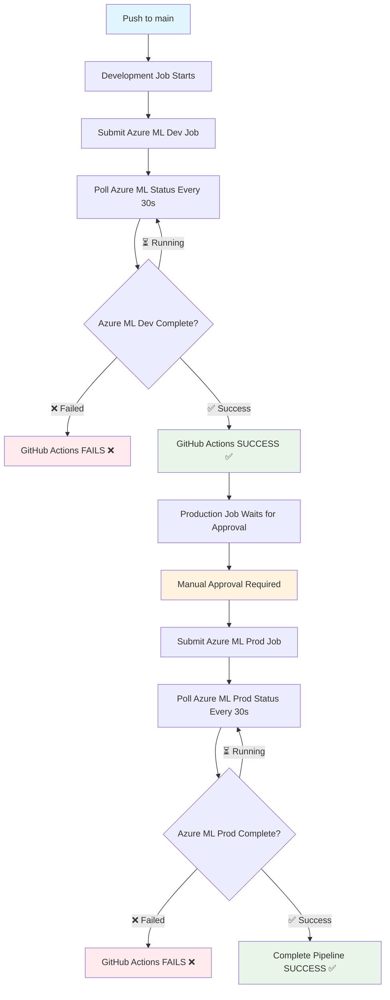

# MLOps Workflow Execution Diagram

## Complete CI/CD Pipeline Flow

## Key Features

- **True Success Validation**: GitHub Actions only succeeds when actual Azure ML training completes
- **Automatic Polling**: Checks Azure ML job status every 30 seconds
- **Fail-Fast**: Stops pipeline immediately if any Azure ML job fails
- **Manual Approval**: Production requires human approval before training
- **End-to-End Tracking**: Full visibility from code commit to model training completion

## Status Meanings

| Status | Description |
|--------|-------------|
| **Completed** | Azure ML job finished successfully |
| **Failed** | Azure ML job encountered an error |
| **Running** | Azure ML job is still training |
| **Canceled** | Azure ML job was manually stopped |
| **NotStarted** | Azure ML job hasn't begun execution |

This diagram shows the enhanced workflow that ensures the production job only runs when the experiment job's **Azure ML training** (not just submission) completes successfully.
