# MLOps Workflow Execution Diagram

## Complete CI/CD Pipeline Flow (Training + Deployment)

> **Note**: This diagram shows the normal workflow when all jobs are enabled (development, production, PR checks).

```mermaid
graph TD
    A[Push to main] --> B[Development Job Starts]
    B --> C[Submit Azure ML Dev Job]
    C --> D[Poll Dev Job Status Every 30s]
    D --> E{Dev Job Complete?}
    E -->|❌ Failed| F[GitHub Actions FAILS ❌]
    E -->|⏳ Running| D
    E -->|✅ Success| G[Dev Job SUCCESS ✅]
    
    G --> H[Production Job Waits for Approval]
    H --> I[Manual Approval Required]
    I --> J[Submit Azure ML Prod Job]
    J --> K[Poll Prod Job Status Every 30s]
    K --> L{Prod Job Complete?}
    L -->|❌ Failed| M[GitHub Actions FAILS ❌]
    L -->|⏳ Running| K
    L -->|✅ Success| N[Training SUCCESS ✅]
    N --> O[Register Model in Azure ML]
    O --> P[Model Registered in Model Registry]
    
    P --> Q[Manual: Deploy Model Workflow]
    Q --> R[Select: Blue or Green Deployment?]
    R -->|Blue| S[Use deployment-blue.yml]
    R -->|Green| T[Use deployment-green.yml]
    S --> U[Verify Model Exists]
    T --> U
    U --> V{Model Exists?}
    V -->|❌ No| W[ERROR: Run Training First]
    V -->|✅ Yes| X[Create/Update Endpoint]
    X --> Y[Deploy to Selected Slot]
    Y --> Z{Blue or Green?}
    Z -->|Blue| AA[Set Traffic: Blue=100%]
    Z -->|Green| AB[Set Traffic: Green=0%]
    AA --> AC[Automatic Endpoint Test]
    AB --> AC
    AC --> AD{Test Passed?}
    AD -->|❌ Failed| AE[Deployment FAILS ❌]
    AD -->|✅ Success| AF[🎉 Deployment Successful]
    
    AF --> AG[Test Options]
    AG --> AH[Azure ML Studio Test Tab]
    AG --> AI[Python test_endpoint.py]
    AG --> AJ[cURL or Postman]
    
    AF --> AK{Need Blue-Green?}
    AK -->|No| AL[Keep Single Deployment]
    AK -->|Yes - New Model| AM[Deploy Green Deployment]
    
    AM --> AN[GitHub: Deploy Model → Select Green]
    AN --> AO[Green Deployed with 0% Traffic]
    AO --> AP[LOCAL: Test Green Manually]
    AP --> AQ{Green Works?}
    AQ -->|❌ Failed| AR[Delete Green, Fix Issues]
    AQ -->|✅ Good| AS[LOCAL: Shift Traffic Gradually]
    
    AS --> AT[LOCAL: manage-traffic.ps1 blue-90]
    AT --> AU[Monitor 30 min]
    AU --> AV{Still Good?}
    AV -->|❌ Issues| AW[LOCAL: Rollback blue-100]
    AV -->|✅ Yes| AX[LOCAL: manage-traffic.ps1 blue-75]
    
    AX --> AY[Monitor 30 min]
    AY --> AZ{Still Good?}
    AZ -->|❌ Issues| AW
    AZ -->|✅ Yes| BA[LOCAL: manage-traffic.ps1 green-100]
    
    BA --> BB[Monitor 1-2 hours]
    BB --> BC{Green Stable?}
    BC -->|❌ Issues| AW
    BC -->|✅ Yes| BD[LOCAL: Delete Blue Deployment]
    
    BD --> BE[💰 Cost Back to Normal]
    BE --> BF[🎉 Blue-Green Complete]
    
    AW --> BG[Investigate Issues]
    BG --> BH[Fix and Redeploy]
    AR --> BG
    
    AL --> BF
    
    style A fill:#e1f5fe
    style F fill:#ffebee
    style M fill:#ffebee
    style W fill:#ffebee
    style AE fill:#ffebee
    style AR fill:#ffebee
    style AW fill:#ffebee
    style G fill:#e8f5e8
    style N fill:#e8f5e8
    style P fill:#e8f5e8
    style AF fill:#c8e6c9
    style BF fill:#c8e6c9
    style I fill:#fff3e0
    style Q fill:#fff3e0
    style R fill:#fff3e0
    style AM fill:#e3f2fd
    style AN fill:#e3f2fd
    style AS fill:#e3f2fd
    style AT fill:#e3f2fd
    style AX fill:#e3f2fd
    style BA fill:#e3f2fd
```

## Workflow Stages

### Stage 1: Training Pipeline
1. **Development Training**: Triggered on push to main
   - Uses diabetes-dev-folder data
   - Validates model training works
   - Must succeed before production

2. **Production Training**: Requires manual approval
   - Uses diabetes-prod-folder data
   - Trains with production data
   - Registers model in Model Registry
   - Waits for approval in GitHub Actions
   - Submits Azure ML job with production data
   - Polls for completion every 30 seconds
   - Automatically registers model on success

### Stage 2: Deployment Pipeline
1. **Manual Deployment Trigger**: Run from GitHub Actions
   - Select: Blue or Green deployment
   - Blue → Uses `src/deployment-blue.yml` → Creates `diabetes-deploy-blue` (100% traffic)
   - Green → Uses `src/deployment-green.yml` → Creates `diabetes-deploy-green` (0% traffic)

2. **Deployment Process**:
   - Verifies model is registered
   - Creates/updates endpoint
   - Deploys to selected slot (blue or green)
   - Sets initial traffic allocation
   - Tests endpoint automatically

### Stage 3: Traffic Management (LOCAL)
1. **After Green Deployment**: Manage traffic locally using PowerShell script
   - `.\deployment\manage-traffic.ps1 blue-90` (10% to green)
   - Monitor metrics for 30 minutes
   - Gradually increase: 25% → 50% → 100%
   - Delete old deployment to save costs

2. **Rollback if Needed**: 
   - `.\deployment\manage-traffic.ps1 blue-100` (instant rollback)

## Key Features

- ✅ **True Success Validation**: Only succeeds when Azure ML training completes
- ✅ **Automatic Polling**: Checks job status every 30 seconds
- ✅ **Fail-Fast**: Stops pipeline immediately on any failure
- ✅ **Manual Approval**: Production training requires human approval
- ✅ **Auto Registration**: Model registered after successful training
- ✅ **Managed Endpoints**: Scalable, production-ready inference
- ✅ **Automatic Testing**: Endpoint tested during deployment
- ✅ **Blue-Green Deployment**: Zero-downtime model updates with rollback capability
- ✅ **Traffic Management**: Gradual rollout with instant rollback options
- ✅ **End-to-End Tracking**: Full visibility from code to production

## Workflows

| Workflow | Trigger | Purpose |
|----------|---------|---------|
| `02-train-and-register-prod-model.yml` | Push to main | Train dev → Train prod → Register model |
| `03-deploy-model.yml` | Manual | Deploy registered model to endpoint |

## Azure ML Job Status

| Status | Description |
|--------|-------------|
| **Completed** | Job finished successfully |
| **Failed** | Job encountered an error |
| **Running** | Job is executing |
| **Queued** | Job waiting for compute resources |
| **Canceled** | Job was manually stopped |
| **NotStarted** | Job hasn't begun execution |

## Color Legend

- 🔵 **Blue**: Start/trigger points
- 🟢 **Green**: Success states
- 🔴 **Red**: Failure states
- 🟠 **Orange**: Manual approval required
- ⚪ **Light Blue**: Model registered
- 🔵 **Light Blue**: Blue-green deployment steps

---

This diagram shows the complete MLOps pipeline from code commit through training to production deployment.
