# MLOps Workflow Execution Diagram

## Complete CI/CD Pipeline Flow (Training + Deployment)

```mermaid
graph TD
    A[Push to main] --> B[Development Job Starts]
    B --> C[Submit Azure ML Dev Job]
    C --> D[Poll Azure ML Status Every 30s]
    D --> E{Azure ML Dev Complete?}
    E -->|❌ Failed| F[GitHub Actions FAILS ❌]
    E -->|⏳ Running| D
    E -->|✅ Success| G[Dev Job SUCCESS ✅]
    G --> H[Production Job Waits for Approval]
    H --> I[Manual Approval Required]
    I --> J[Submit Azure ML Prod Job]
    J --> K[Poll Azure ML Prod Status Every 30s]
    K --> L{Azure ML Prod Complete?}
    L -->|❌ Failed| M[GitHub Actions FAILS ❌]
    L -->|⏳ Running| K
    L -->|✅ Success| N[Training SUCCESS ✅]
    N --> O[Register Model in Azure ML]
    O --> P[Model Registered]
    
    P --> Q[Manual: Deploy Model Workflow]
    Q --> R[Verify Model Already Registered]
    R --> S{Model Exists?}
    S -->|❌ No| T[ERROR: Run Training First]
    S -->|✅ Yes| U[Create/Update Endpoint]
    U --> V[Deploy Model to Endpoint]
    V --> W[Allocate 100% Traffic]
    W --> X[Automatic Endpoint Test]
    X --> Y{Test Passed?}
    Y -->|❌ Failed| Z[Deployment FAILS ❌]
    Y -->|✅ Success| AA[🎉 Model Live in Production]
    
    AA --> BB[Test Options]
    BB --> BC[Azure ML Studio Test Tab]
    BB --> BD[Python test_endpoint.py]
    BB --> BE[cURL or Postman]
    
    AA --> BF[Blue-Green Deployment Ready]
    BF --> BG[New Model Version Available?]
    BG -->|Yes| BH[Deploy Green with New Model]
    BG -->|No| BI[Keep Current Blue Deployment]
    
    BH --> BJ[Set Green to 0% Traffic]
    BJ --> BK[Test Green with 10% Traffic]
    BK --> BL{Green Performance OK?}
    BL -->|❌ Issues| BM[Rollback to Blue 100%]
    BL -->|✅ Good| BN[Gradual Traffic Shift]
    
    BN --> BO[Blue 75% → Green 25%]
    BO --> BP{Still Good?}
    BP -->|✅ Yes| BQ[Blue 50% → Green 50%]
    BP -->|❌ Issues| BM
    
    BQ --> BR[Blue 0% → Green 100%]
    BR --> BS[Delete Old Blue Deployment]
    
    BM --> BT[Investigate Green Issues]
    BT --> BU[Fix and Redeploy Green]
    BU --> BK
    
    BS --> BV[🎉 Blue-Green Complete]
    BI --> BV
    
    style A fill:#e1f5fe
    style F fill:#ffebee
    style M fill:#ffebee
    style T fill:#ffebee
    style Z fill:#ffebee
    style BM fill:#ffebee
    style G fill:#e8f5e8
    style N fill:#e8f5e8
    style P fill:#e1f0ff
    style AA fill:#c8e6c9
    style BV fill:#c8e6c9
    style I fill:#fff3e0
    style Q fill:#fff3e0
    style BF fill:#fff3e0
    style BH fill:#e3f2fd
    style BJ fill:#e3f2fd
    style BK fill:#e3f2fd
    style BN fill:#e3f2fd
    style BO fill:#e3f2fd
    style BQ fill:#e3f2fd
    style BR fill:#e3f2fd
    style BS fill:#e3f2fd
```

## Workflow Stages

### Stage 1: Training Pipeline (Automated)
1. **Development Training**: Triggered on push to main
   - Submits Azure ML job with dev data
   - Polls for completion every 30 seconds
   - Must succeed before proceeding

2. **Production Training**: Requires manual approval
   - Waits for approval in GitHub Actions
   - Submits Azure ML job with production data
   - Polls for completion every 30 seconds
   - Automatically registers model on success

### Stage 2: Deployment Pipeline (Manual Trigger)
3. **Model Deployment**: Run via GitHub Actions workflow
   - Finds latest completed production job
   - Registers model from job output
   - Creates or updates managed endpoint
   - Deploys model with traffic allocation
   - Automatically tests the endpoint

4. **Testing & Validation**
   - Azure ML Studio Test tab (GUI)
   - Python script (`test_endpoint.py`)
   - cURL or Postman (API testing)

### Stage 3: Blue-Green Deployment (Optional)
5. **Blue-Green Strategy**: When new model versions are available
   - Deploy green deployment with new model (0% traffic)
   - Test green with 10% traffic allocation
   - Monitor performance and validate results
   - Gradual traffic shift: 25% → 50% → 100%
   - Rollback to blue if issues detected
   - Clean up old blue deployment after successful switch

## Key Features

- ✅ **True Success Validation**: Only succeeds when Azure ML training completes
- ✅ **Automatic Polling**: Checks job status every 30 seconds
- ✅ **Fail-Fast**: Stops pipeline immediately on any failure
- ✅ **Manual Approval**: Production training requires human approval
- ✅ **Auto Registration**: Model registered after successful training
- ✅ **Managed Endpoints**: Scalable, production-ready inference
- ✅ **Automatic Testing**: Endpoint tested during deployment
- ✅ **Blue-Green Deployment**: Zero-downtime model updates with rollback capability
- ✅ **Traffic Management**: Gradual rollout with instant rollback options
- ✅ **End-to-End Tracking**: Full visibility from code to production

## Workflows

| Workflow | Trigger | Purpose |
|----------|---------|---------|
| `06-train-and-deploy.yml` | Push to main | Train dev → Train prod → Register model |
| `07-deploy-model.yml` | Manual | Deploy registered model to endpoint |

## Azure ML Job Status

| Status | Description |
|--------|-------------|
| **Completed** | Job finished successfully |
| **Failed** | Job encountered an error |
| **Running** | Job is executing |
| **Queued** | Job waiting for compute resources |
| **Canceled** | Job was manually stopped |
| **NotStarted** | Job hasn't begun execution |

## Color Legend

- 🔵 **Blue**: Start/trigger points
- 🟢 **Green**: Success states
- 🔴 **Red**: Failure states
- 🟠 **Orange**: Manual approval required
- ⚪ **Light Blue**: Model registered
- 🔵 **Light Blue**: Blue-green deployment steps

---

This diagram shows the complete MLOps pipeline from code commit through training to production deployment.
